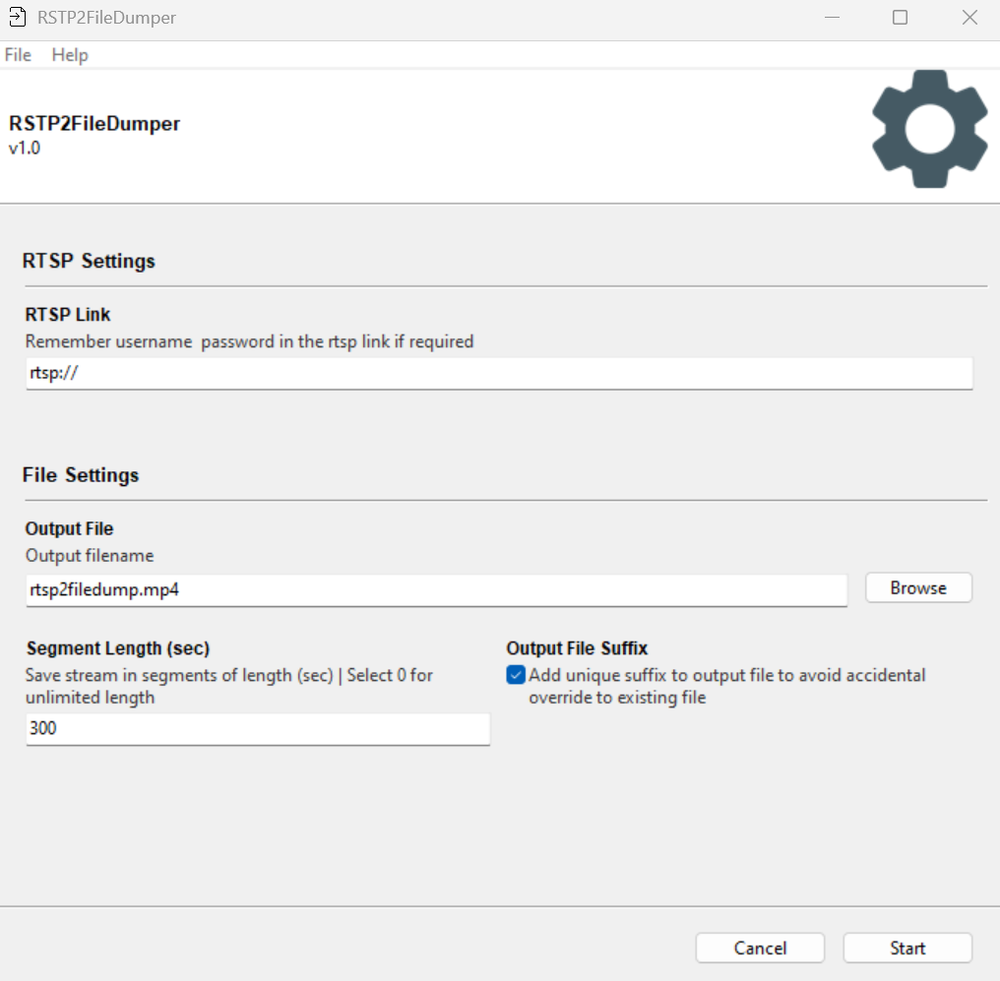

# rtsp2file-dump
GUI to dump an RTSP stream to a file. Basically it runs some ffmpeg commands in background. I made this GUI to make the process of collecting multiple CCTV streams simultaneously a bit easier. 



For reference, following are the commands it runs:

```
# To check whether RTSP stream is working
ffprobe -v quiet -print_format json -timeout 5000000 -show_streams RTSP_LINK

# To save stream in one big file
ffmpeg -i RTSP_LINK, -nostats -fflags nobuffer -vcodec copy -reset_timestamps 1 -y FILE_NAME.EXTENSION

# To save stream in segments of length SEGMENT_LENGTH seconds
ffmpeg -i RTSP_LINK, -nostats -fflags nobuffer -vcodec copy -f segment -segment_time SEGMENT_LENGTH -reset_timestamps 1 -y FILE_NAME%d.EXTENSION

```

## How to Use
- Download and run exe file from releases.
- Configure your settings and click on start.
- RTSP2FileDumper will run indefinitely unless stopped. 

## Steps to Run GUI
```
python RSTP2FileDumper.py
```

## Steps to Create EXE
Replace SCRIPT_PATH and IMAGES_PATH in build_win_local.spec to absolute path to RSTP2FileDumper.py and images folder respectively, then run the following command:
```
pyinstaller build_win_local.spec
```

## Settings
- **RTSP Link:** Give correct RTSP link. Link validation has been turned off. Add `type=rtsp_link_checker` to rtsp arguement in the RSTP2FileDumper.py to turn in on.
- **Output File:** Output file to save the stream.
- **Segment Length:** Give segment length in sec, if you wish RTSP link to be saved in segments. Give 0 for save in only one big file.
- **Output File Suffix:** When turned on, this will add _YEAR_MONTH_DAY_HOUR_MILLISEC suffix to avoid accidental overwriting of previous files.

## Bugs
- This only works on windows as of now. Not tested on linux yet. Will probably have to make changes to `shutdown_signal` setting for Gooey.
- A blank terminal opens when .exe is run. This is because of `console=True` setting in build_win_local.specs. But without this, the exe fails to run correctly. It's been tricky to run ffmpeg and pyinstaller together correctly. 